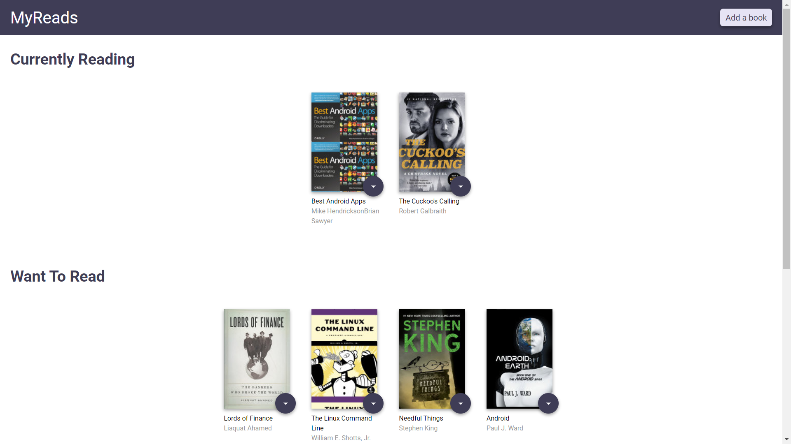
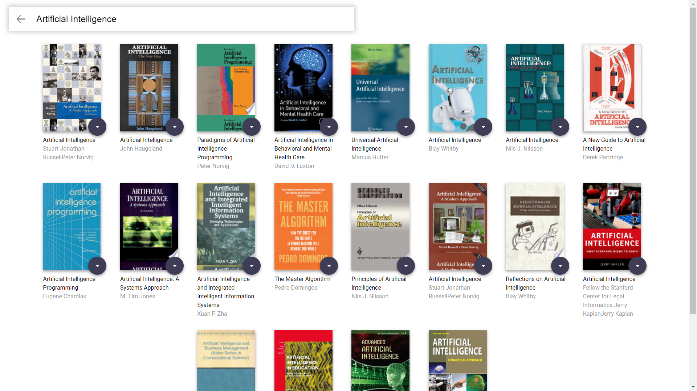

# MyReads
# Made By Smith Gajjar

Table of Contents 
 - [Introduction](#introduction)
 - [Installation](#installation)
 - [Usage](#usage)
 - [Screenshots](#screenshots)

# Introduction
MyReads is a simple cataloging app and 1st Project in React Nano Degree that allows you to place books in one of three shelves or categories.
- Currently Reading
- Want to Read
- Read
It also allow you to search for books based on title and author.

## Installation

Clone the repository, change directories, and use NPM to install the dependencies.

$ cd reactnd-project-myreads
$ npm install

## Usage

The project can be run with

- `npm start`

Then Project can be viewed at localhost:3000

## Screenshots

